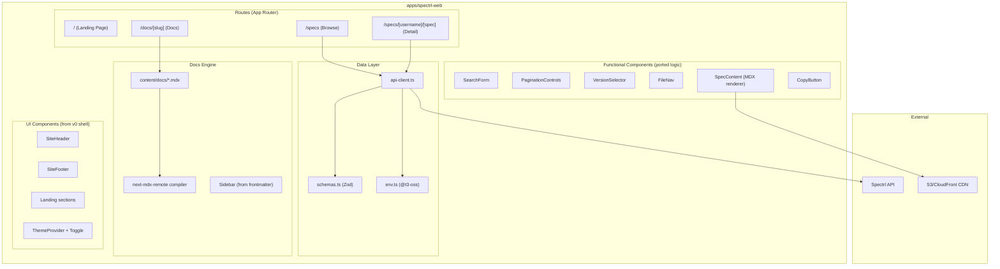

# Design Document: Website Migration

## Overview

This design covers migrating the Spectrl product website from the current Next.js app (with Nextra docs, custom UI) to a new implementation based on a v0.dev design prototype. The v0 shell provides the visual identity (landing page, layout, component styling) while the existing app provides the functional backbone (Zod-validated API client, cursor-based pagination, version selection, MDX file rendering). The Nextra docs system is replaced with `.mdx` files on disk compiled via `next-mdx-remote`.

The migration strategy is: start from the v0 design shell, port the data layer and business logic in, replace mock data with real API calls, and swap the docs system.

## Architecture

The new website follows the same Next.js App Router architecture as both the existing app and the v0 prototype. It lives at `apps/spectrl-web/` within the pnpm monorepo.



### Key Architectural Decisions

1. **Start from v0 shell, port logic in**: The v0 prototype has the target visual design but only mock data. Rather than reskinning the existing app, we adopt the v0 shell and wire in the real data layer. This avoids fighting two design systems.

2. **Copy existing `lib/` files directly**: The entire `src/lib/` folder from the current app (`api-client.ts`, `schemas.ts`, `env.ts`, `utils.ts`, `test-setup.ts`) is copied into the new app as-is. These files are battle-tested and contain the Zod-validated API client, schemas, and environment config. No rewriting — just copy and verify they work in the new context. Similarly, the `useCursorHistory` hook is copied directly from `src/hooks/`.

3. **Copy existing test files directly**: The test suites (`api-client.test.ts`, `useCursorHistory.test.ts`, `PaginationControls.test.tsx`) are copied from the current app. They may need minor import path adjustments but the test logic stays the same. If all existing tests pass in the new app, we have confidence the business logic is intact.

4. **Ditch Nextra for `next-mdx-remote`**: Nextra adds significant complexity (its own layout system, page map generation, theme package). A simpler approach: read `.mdx` files from `content/docs/`, compile with `next-mdx-remote`, generate sidebar from frontmatter. Less magic, more control.

5. **Keep Zod validation for all API responses**: Per project steering rules, all external data is validated with Zod schemas using `.safeParse()`. The existing `api-client.ts` and `schemas.ts` are used as-is.

6. **Form-submit search (no debounce)**: Search on the browse page uses form submission to update URL params, not debounced input. The landing page search also navigates to `/specs?q={query}` on submit.

7. **Cursor-based pagination with session storage history**: The existing `useCursorHistory` hook pattern is preserved — it stores cursor tokens in session storage scoped by query to enable Previous/Next navigation.

## Components and Interfaces

### Directory Structure

```
apps/spectrl-web/
├── src/
│   ├── app/
│   │   ├── layout.tsx              # Root layout (ThemeProvider, fonts)
│   │   ├── page.tsx                # Landing page (v0 design)
│   │   ├── globals.css             # Global styles (v0 design)
│   │   ├── specs/
│   │   │   ├── page.tsx            # Browse specs (server component, real API)
│   │   │   └── [username]/
│   │   │       └── [spec]/
│   │   │           └── page.tsx    # Spec detail (server component, real API)
│   │   └── docs/
│   │       ├── layout.tsx          # Docs layout with sidebar
│   │       ├── page.tsx            # Docs index (redirect to introduction)
│   │       └── [slug]/
│   │           └── page.tsx        # Individual doc page
│   ├── components/
│   │   ├── landing/                # v0 landing sections (Hero, CliDemo, etc.)
│   │   ├── specs/                  # v0 spec components (adapted for real data)
│   │   │   ├── spec-card.tsx       # Search result card
│   │   │   ├── spec-detail.tsx     # Detail page content
│   │   │   ├── spec-content.tsx    # MDX file renderer (ported logic)
│   │   │   ├── file-nav.tsx        # File tab navigation
│   │   │   ├── version-selector.tsx # Version combobox
│   │   │   └── specs-search.tsx    # Search + results list
│   │   ├── docs/                   # Docs sidebar and mobile nav
│   │   │   ├── docs-sidebar.tsx    # Generated from frontmatter
│   │   │   └── docs-mobile-nav.tsx # Mobile dropdown
│   │   ├── ui/                     # shadcn/ui primitives (trimmed)
│   │   ├── site-header.tsx         # v0 header
│   │   ├── site-footer.tsx         # v0 footer
│   │   ├── spectrl-logo.tsx        # v0 logo
│   │   ├── copy-button.tsx         # Clipboard copy with feedback
│   │   ├── search-form.tsx         # Search input with URL sync
│   │   ├── pagination-controls.tsx # Cursor-based pagination
│   │   ├── theme-provider.tsx      # next-themes wrapper
│   │   └── theme-toggle.tsx        # Dark/light toggle
│   ├── hooks/
│   │   └── use-cursor-history.ts   # Pagination cursor stack
│   ├── lib/
│   │   ├── api-client.ts           # Zod-validated API functions
│   │   ├── schemas.ts              # Zod schemas for API responses
│   │   ├── env.ts                  # @t3-oss/env-nextjs config
│   │   ├── docs.ts                 # Docs utilities (read MDX, parse frontmatter)
│   │   ├── utils.ts                # cn() utility
│   │   └── test-setup.ts           # Vitest setup (mock env vars)
│   └── content/
│       └── docs/                   # MDX files on disk
│           ├── introduction.mdx
│           ├── getting-started.mdx
│           ├── installation.mdx
│           └── cli-reference.mdx
├── package.json
├── tsconfig.json
├── next.config.mjs
├── postcss.config.mjs
├── vitest.config.ts
├── .env.development
└── .env.production
```

### Component Interfaces

#### Data Layer (copied from existing app as-is)

The following files are copied directly from `apps/spectrl-web/src/lib/` and `apps/spectrl-web/src/hooks/` into the new app. No modifications to business logic — only import paths may need adjustment if the directory structure changes.

```typescript
// lib/schemas.ts — Zod schemas for API response validation
import { z } from 'zod';

export const SearchResultSchema = z.object({
  specId: z.string(),
  version: z.string(),
  username: z.string(),
  specName: z.string(),
  description: z.string(),
  tags: z.array(z.string()),
  publishedAt: z.string(),
});

export const SearchResponseSchema = z.object({
  results: z.array(SearchResultSchema),
  count: z.number(),
  nextToken: z.string().optional(),
  hasMore: z.boolean().optional(),
});

export const SpecVersionSchema = z.object({
  version: z.string(),
  description: z.string(),
  tags: z.array(z.string()).optional(),
  publishedAt: z.string(),
  s3Path: z.string(),
  hash: z.string().regex(/^sha256:[a-f0-9]{64}$/),
  files: z.array(z.string().min(1)),
  downloads: z.number().optional(),
});

export const GetSpecResponseSchema = z.object({
  specId: z.string(),
  username: z.string(),
  specName: z.string(),
  versions: z.array(SpecVersionSchema),
});

export const ApiErrorResponseSchema = z.object({
  error: z.string(),
});

// Types derived from schemas
export type SearchResult = z.infer<typeof SearchResultSchema>;
export type SearchResponse = z.infer<typeof SearchResponseSchema>;
export type SpecVersion = z.infer<typeof SpecVersionSchema>;
export type GetSpecResponse = z.infer<typeof GetSpecResponseSchema>;

// Error classes
export class ApiError extends Error {
  constructor(
    message: string,
    public statusCode: number,
    public response?: unknown,
  ) {
    super(message);
    this.name = 'ApiError';
  }
}

export class NetworkError extends Error {
  constructor(
    message: string,
    public cause?: Error,
  ) {
    super(message);
    this.name = 'NetworkError';
  }
}
```

```typescript
// lib/api-client.ts — API functions with Zod validation
export async function searchSpecs(
  query?: string,
  options?: { nextToken?: string; limit?: number },
): Promise<SearchResponse>;

export async function getSpec(username: string, specName: string): Promise<GetSpecResponse>;

export async function getSpecFile(s3Path: string, filename: string): Promise<string>;

export function isNotFoundError(error: unknown): boolean;
export function isNetworkError(error: unknown): boolean;
```

```typescript
// lib/env.ts — Validated environment configuration
import { createEnv } from '@t3-oss/env-nextjs';
import { z } from 'zod';

export const env = createEnv({
  server: { NODE_ENV: z.enum(['development', 'test', 'production']) },
  client: {
    NEXT_PUBLIC_API_URL: z.string().url(),
    NEXT_PUBLIC_CDN_URL: z.string().url(),
  },
  experimental__runtimeEnv: {
    NEXT_PUBLIC_API_URL: process.env.NEXT_PUBLIC_API_URL,
    NEXT_PUBLIC_CDN_URL: process.env.NEXT_PUBLIC_CDN_URL,
  },
});
```

#### Docs Engine (new)

```typescript
// lib/docs.ts — Docs utilities

interface DocMeta {
  slug: string;
  title: string;
  order: number;
}

/** Read all MDX files from content/docs/, extract frontmatter, return sorted metadata */
export async function getDocsList(): Promise<DocMeta[]>;

/** Read and compile a single MDX file by slug */
export async function getDocBySlug(slug: string): Promise<{
  meta: DocMeta;
  content: React.ReactElement;
} | null>;
```

MDX frontmatter format:

```yaml
---
title: 'Introduction'
order: 1
---
```

#### Functional Components

```typescript
// components/search-form.tsx
interface SearchFormProps {
  placeholder?: string;
  className?: string;
  autoFocus?: boolean;
}
// Renders a form with search input. On submit, navigates to /specs?q={query}.
// Reads initial value from URL ?q param. Clear button resets input.

// components/pagination-controls.tsx
interface PaginationControlsProps {
  query: string;
  currentNextToken?: string;
  nextToken?: string;
  hasMore: boolean;
  count: number;
}
// Renders Previous/Next buttons with cursor history management.
// Uses useCursorHistory hook for session-storage-backed navigation.

// components/specs/version-selector.tsx
interface VersionSelectorProps {
  versions: { version: string; publishedAt: string }[];
  currentVersion: string;
}
// Combobox (cmdk) for selecting spec versions. Navigates via ?v= param.

// components/specs/file-nav.tsx
interface FileNavProps {
  files: string[];
  currentFile: string;
  onFileSelect: (file: string) => void;
}
// Tab buttons for switching between files. Hidden when only one file.

// components/specs/spec-content.tsx
interface SpecContentProps {
  files: string[];
  s3Path: string;
  initialFile: string;
  initialContent: string;
}
// Manages file selection state. Fetches file content via getSpecFile().
// Compiles markdown to React elements via next-mdx-remote with styled overrides.

// components/copy-button.tsx
interface CopyButtonProps {
  value: string;
  className?: string;
}
// Copies value to clipboard. Shows check icon for 2s on success.
// Includes fallback for browsers without Clipboard API.

// hooks/use-cursor-history.ts
export function useCursorHistory(query?: string): {
  history: string[];
  pushCursor: (cursor: string) => void;
  popCursor: () => string | undefined;
  clearHistory: () => void;
  getCurrentCursor: () => string | undefined;
  getPreviousCursor: () => string | undefined;
  hasPrevious: boolean;
};
// Session-storage-backed cursor stack, scoped per search query.
```

## Data Models

### API Response Models (Zod-validated)

All types are derived from Zod schemas via `z.infer<>`. No type casting is used for external data.

| Model              | Source             | Key Fields                                                                  |
| ------------------ | ------------------ | --------------------------------------------------------------------------- |
| `SearchResult`     | `/search` API      | specId, version, username, specName, description, tags, publishedAt         |
| `SearchResponse`   | `/search` API      | results[], count, nextToken?, hasMore?                                      |
| `SpecVersion`      | `/specs/:u/:n` API | version, description, tags?, publishedAt, s3Path, hash, files[], downloads? |
| `GetSpecResponse`  | `/specs/:u/:n` API | specId, username, specName, versions[]                                      |
| `ApiErrorResponse` | Error responses    | error (string)                                                              |

### Doc Frontmatter Model

```typescript
interface DocMeta {
  slug: string; // Derived from filename (e.g., "introduction")
  title: string; // From frontmatter: "Introduction"
  order: number; // From frontmatter: 1 (controls sidebar ordering)
}
```

### Cursor History Model

```typescript
// Session storage key format: `spectrl:cursor-history:{query}`
// Value: JSON array of cursor token strings
// Example: ["eyJzcGVjSWQiOiJ0ZXN0MSJ9", "eyJzcGVjSWQiOiJ0ZXN0MiJ9"]
```

### Environment Variables

| Variable              | Validation                                      | Usage                          |
| --------------------- | ----------------------------------------------- | ------------------------------ |
| `NEXT_PUBLIC_API_URL` | `z.string().url()`                              | Base URL for Spectrl API       |
| `NEXT_PUBLIC_CDN_URL` | `z.string().url()`                              | Base URL for S3/CloudFront CDN |
| `NODE_ENV`            | `z.enum(['development', 'test', 'production'])` | Server-side only               |

### Package Dependencies

**Keep from v0 shell**: `next`, `react`, `react-dom`, `next-themes`, `lucide-react`, `tailwind-merge`, `class-variance-authority`, `clsx`, `cmdk`, `@radix-ui/react-*` (only those used by kept shadcn/ui components), `tailwindcss`, `@tailwindcss/postcss`, `tw-animate-css`

**Port from existing app**: `zod`, `@t3-oss/env-nextjs`, `next-mdx-remote`

**Add for testing**: `vitest`, `msw`, `fast-check`, `happy-dom`, `@testing-library/react`, `@testing-library/user-event`

**Remove from v0 shell**: `recharts`, `embla-carousel-react`, `react-day-picker`, `react-resizable-panels`, `@vercel/analytics`, `react-hook-form`, `@hookform/resolvers`, `input-otp`, `vaul`, `sonner`, `date-fns`, `autoprefixer`

**Remove from existing app**: `nextra`, `nextra-theme-docs`, `tailwindcss-animate` (replaced by `tw-animate-css`)

## Correctness Properties

_A property is a characteristic or behavior that should hold true across all valid executions of a system — essentially, a formal statement about what the system should do. Properties serve as the bridge between human-readable specifications and machine-verifiable correctness guarantees._

The following properties are derived from the acceptance criteria prework analysis. Each property is universally quantified and suitable for property-based testing with `fast-check`.

### Property 1: Schema validation accepts valid objects

_For any_ valid object conforming to `SearchResponseSchema`, `GetSpecResponseSchema`, `SpecVersionSchema`, `SearchResultSchema`, or `ApiErrorResponseSchema`, calling `.safeParse()` on the corresponding schema SHALL return `{ success: true }` with the parsed data matching the input.

**Validates: Requirements 2.6**

### Property 2: Schema validation rejects objects with missing required fields

_For any_ object that is missing one or more required fields from `SearchResponseSchema`, `GetSpecResponseSchema`, `SpecVersionSchema`, or `SearchResultSchema`, calling `.safeParse()` SHALL return `{ success: false }`.

**Validates: Requirements 2.6**

### Property 3: API client rejects invalid responses

_For any_ JSON response body that does not conform to the expected Zod schema, calling `searchSpecs` or `getSpec` SHALL throw an `ApiError` with a message containing validation error details.

**Validates: Requirements 2.1, 2.2, 2.4**

### Property 4: Docs sidebar is sorted by order

_For any_ list of `DocMeta` objects with distinct `order` values, `getDocsList()` SHALL return them sorted in ascending order by the `order` field.

**Validates: Requirements 5.3**

## Error Handling

### API Errors

| Scenario                             | Behavior                                                                                                                                   |
| ------------------------------------ | ------------------------------------------------------------------------------------------------------------------------------------------ |
| API returns non-2xx status           | `handleApiResponse` attempts to parse error body with `ApiErrorResponseSchema`. Throws `ApiError` with parsed message or HTTP status text. |
| API response fails Zod validation    | Throws `ApiError` with first validation issue message. Logs full validation error to console.                                              |
| Network failure (DNS, timeout, etc.) | Throws `NetworkError` wrapping the original error.                                                                                         |
| `getSpecFile` returns non-2xx        | Throws `ApiError` with HTTP status.                                                                                                        |
| Spec not found (404)                 | `isNotFoundError()` utility returns true. Spec detail page calls `notFound()`.                                                             |

### Docs Errors

| Scenario                            | Behavior                                                  |
| ----------------------------------- | --------------------------------------------------------- |
| MDX file not found for slug         | `getDocBySlug()` returns `null`. Page calls `notFound()`. |
| MDX compilation fails               | Error is caught and logged. Page shows error message.     |
| Frontmatter missing required fields | Doc is excluded from sidebar or uses defaults.            |

### UI Error States

| Page                                | Error State                                                  |
| ----------------------------------- | ------------------------------------------------------------ |
| `/specs` (search)                   | Alert component with error message and "Try Again" link      |
| `/specs/[username]/[spec]` (detail) | 404 → Next.js not-found page. Other errors → error boundary. |
| Spec file loading                   | Inline error message within content area                     |
| `/docs/[slug]`                      | 404 → Next.js not-found page                                 |

## Testing Strategy

### Dual Testing Approach

The testing strategy uses both unit/example tests and property-based tests:

- **Unit tests**: Verify specific examples, edge cases, error conditions, and UI interactions
- **Property tests**: Verify universal properties across many generated inputs using `fast-check`

### Test Infrastructure

- **Framework**: Vitest with happy-dom environment
- **HTTP Mocking**: MSW (Mock Service Worker) — never override `global.fetch`
- **Property Testing**: fast-check with minimum 100 iterations per property
- **Component Testing**: @testing-library/react + @testing-library/user-event
- **Setup**: `src/lib/test-setup.ts` sets mock env vars (`NEXT_PUBLIC_API_URL`, `NEXT_PUBLIC_CDN_URL`)

### Test Suites (copied from existing app)

These existing test suites are copied from the current app with path adjustments as needed:

1. **`api-client.test.ts`** — MSW-based tests for `searchSpecs`, `getSpec`. Covers: valid responses, pagination params, invalid response rejection, API error handling, missing pagination fields.

2. **`useCursorHistory.test.ts`** — Hook tests for cursor stack. Covers: empty init, push/pop, duplicate prevention, session storage persistence, cross-query isolation, corrupted storage handling, cleanup on clear.

3. **`PaginationControls.test.tsx`** — Component tests. Covers: result count display, button states, ARIA labels, cursor push on mount, navigation URL construction.

### New Property-Based Tests

Each property test references a design property and runs minimum 100 iterations:

| Property   | Test Description                                                               | Generator Strategy                                                                    |
| ---------- | ------------------------------------------------------------------------------ | ------------------------------------------------------------------------------------- |
| Property 1 | Generate valid schema-conforming objects, verify safeParse succeeds            | `fc.record()` matching each schema's shape                                            |
| Property 2 | Generate objects with randomly removed required fields, verify safeParse fails | Start from valid object, randomly delete 1+ required keys                             |
| Property 3 | Mock API to return generated invalid JSON, verify ApiError is thrown           | `fc.anything()` filtered to exclude valid shapes                                      |
| Property 4 | Generate lists of DocMeta with random orders, verify sorted output             | `fc.array(fc.record({ slug: fc.string(), title: fc.string(), order: fc.integer() }))` |

### Property Test Tagging

Each property test must include a comment referencing the design property:

```typescript
// Feature: website-migration, Property 1: Schema validation accepts valid objects
it.prop([validSearchResponseArb], { numRuns: 100 }, (response) => {
  const result = SearchResponseSchema.safeParse(response);
  expect(result.success).toBe(true);
});
```
