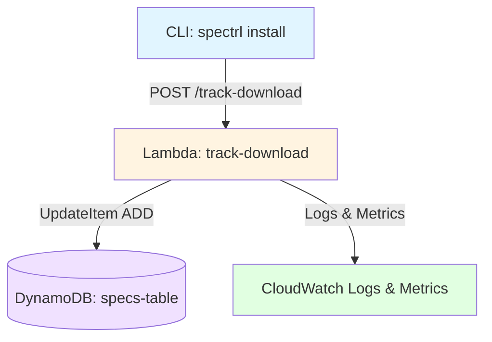
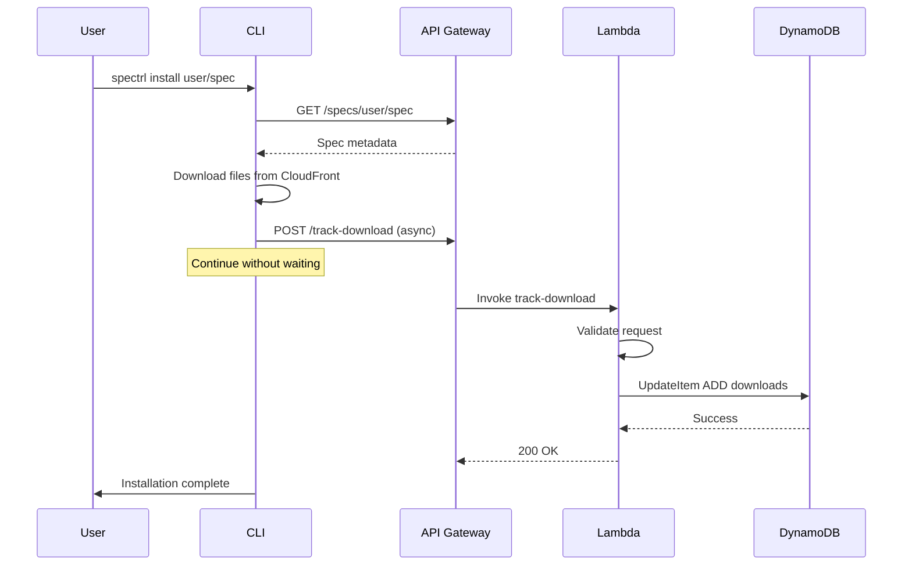

# Design Document: Download Tracking

## Overview

This document defines the technical design for implementing download tracking in the Spectrl public registry. The feature tracks when users install specs from the public registry and maintains download counters in DynamoDB. Download counts provide valuable metrics for spec popularity and help users assess community adoption.

The design follows a fire-and-forget pattern where the CLI reports download events asynchronously without blocking installation. The backend uses atomic DynamoDB operations to ensure accurate counting even under concurrent access.

### Key Design Principles

- **Non-blocking**: Download tracking never blocks or fails spec installation
- **Accurate**: Atomic DynamoDB operations prevent race conditions
- **Secure**: Authentication required, input validation enforced
- **Observable**: Comprehensive logging and metrics for monitoring
- **Simple**: Minimal complexity, leveraging existing patterns

## Architecture

### System Components



### Request Flow



### Data Flow

1. **CLI Installation**: User runs `spectrl install username/spec@version`
2. **File Download**: CLI downloads manifest and files from CloudFront
3. **Track Request**: CLI sends async POST to `/track-download` with timeout
4. **Validation**: Lambda validates authentication and request parameters
5. **Atomic Increment**: Lambda uses DynamoDB ADD operation on downloads field
6. **Response**: Lambda returns success with updated download count
7. **CLI Continues**: CLI completes installation regardless of tracking result

## Components and Interfaces

### Backend Lambda Function

**Location**: `api/track-download/`

**Handler**: `index.ts` exports `handler(event: APIGatewayProxyEvent)`

**Responsibilities**:

- Validate authentication token (GitHub token required)
- Validate request body parameters using Zod
- Perform atomic increment on DynamoDB downloads field
- Return success response with updated count
- Log errors and emit CloudWatch metrics

**Dependencies**:

- `@aws-sdk/client-dynamodb` - DynamoDB client
- `@aws-sdk/lib-dynamodb` - Document client for simplified operations
- `zod` - Request/response validation
- `../shared/github.ts` - GitHub token validation

### CLI Integration

**Location**: `packages/cli/src/commands/install/index.ts`

**Modified Function**: `installFromPublic()`

**Integration Point**: After files are downloaded, before "Install complete" message

**Responsibilities**:

- Track which specs have been tracked in current session (Set)
- Call `trackDownload()` helper after successful file download
- Fire-and-forget pattern with 3-second timeout
- Silent failure handling (log in debug mode only)

**New Helper**: `packages/cli/src/utils/api-client.ts`

```typescript
export async function trackDownload(
  token: string,
  username: string,
  specName: string,
  version: string,
): Promise<void>;
```

### API Gateway Route

**Method**: POST

**Path**: `/track-download`

**Authentication**: Required (Bearer token)

**Rate Limiting**: 100 requests/minute per IP

**Timeout**: 29 seconds (Lambda max)

## Data Models

### DynamoDB Schema

**Table**: `specs-table` (existing)

**Partition Key**: `specId` (String) - Format: `username/specName`

**Sort Key**: `version` (String) - Semver format: `1.0.0`

**New Field**: `downloads` (Number) - Default: 0

**Example Item**:

```json
{
  "specId": "johndoe/my-spec",
  "version": "1.0.0",
  "username": "johndoe",
  "specName": "my-spec",
  "description": "Example spec",
  "type": "spec",
  "tags": ["example"],
  "createdAt": "2024-01-15T10:30:00Z",
  "s3Path": "specs/johndoe/my-spec/1.0.0",
  "hash": "sha256:abc123...",
  "files": ["index.md"],
  "downloads": 42,
  "deps": {}
}
```

### Request Schema

**Endpoint**: POST `/track-download`

**Headers**:

```
Authorization: Bearer <github-token>
Content-Type: application/json
```

**Body**:

```typescript
{
  username: string; // GitHub username (1-39 chars, alphanumeric + hyphens)
  specName: string; // Spec name (1-100 chars, alphanumeric + hyphens + underscores)
  version: string; // Semver version (e.g., "1.0.0")
}
```

**Zod Schema** (`api/track-download/schemas/request.ts`):

```typescript
export const trackDownloadRequestSchema = z.object({
  username: z
    .string()
    .min(1)
    .max(39)
    .regex(/^[a-zA-Z0-9-]+$/),
  specName: z
    .string()
    .min(1)
    .max(100)
    .regex(/^[a-zA-Z0-9-_]+$/),
  version: z.string().regex(/^\d+\.\d+\.\d+(-[a-zA-Z0-9.-]+)?(\+[a-zA-Z0-9.-]+)?$/),
});
```

### Response Schema

**Success Response** (200 OK):

```typescript
{
  success: true;
  downloads: number; // Updated download count
}
```

**Error Response** (4xx/5xx):

```typescript
{
  error: string; // Human-readable error message
}
```

**Zod Schema** (`api/track-download/schemas/response.ts`):

```typescript
export const trackDownloadResponseSchema = z.object({
  success: z.literal(true),
  downloads: z.number().int().min(0),
});

export const errorResponseSchema = z.object({
  error: z.string(),
});
```

### CLI API Client Schema

**Location**: `packages/cli/src/utils/api-client.ts`

**Request Schema**:

```typescript
export const TrackDownloadRequestSchema = z.object({
  username: z.string(),
  specName: z.string(),
  version: z.string(),
});

export type TrackDownloadRequest = z.infer<typeof TrackDownloadRequestSchema>;
```

**Response Schema**:

```typescript
export const TrackDownloadResponseSchema = z.object({
  success: z.literal(true),
  downloads: z.number(),
});

export type TrackDownloadResponse = z.infer<typeof TrackDownloadResponseSchema>;
```

## Correctness Properties

_A property is a characteristic or behavior that should hold true across all valid executions of a system-essentially, a formal statement about what the system should do. Properties serve as the bridge between human-readable specifications and machine-verifiable correctness guarantees._
