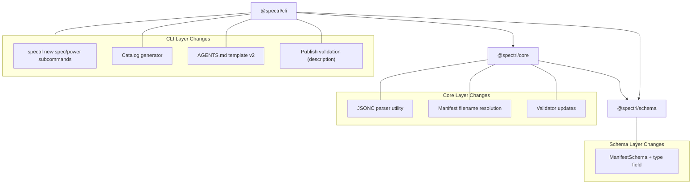

# Design Document: Specs and Powers

## Overview

This feature introduces a `type` discriminator (`"spec" | "power"`) into the spectrl manifest schema, extends the `spectrl new` CLI command to scaffold both types with JSONC manifests, generates a `catalog.md` discovery file during install, updates the AGENTS.md template for type-aware agent discovery, and enforces description at publish time. All changes maintain full backward compatibility with existing manifests.

The implementation touches four packages: `@spectrl/schema` (type field), `@spectrl/core` (JSONC parsing, validation), `@spectrl/cli` (commands, catalog, AGENTS.md template), and the existing test suites.

## Architecture

The changes follow the existing layered architecture:



### Key Design Decisions

1. **JSONC parsing in core, not schema**: The schema package stays pure Zod. JSONC stripping happens in `@spectrl/core` before data reaches the schema validator. This keeps the schema package dependency-free beyond Zod.

2. **Manifest filename resolution with fallback**: A new `resolveManifestPath(dir)` function in core checks for `spectrl.jsonc` first, then `spectrl.json`. This is the single point of truth for filename resolution — all CLI commands use it.

3. **`spectrl new` becomes a subcommand group**: The current `newCmd` in `cli.ts` becomes a `subcommands` group with `spec` and `power` children. A bare `spectrl new <name>` defaults to `spec` via cmd-ts routing.

4. **Catalog generation is a side effect of install**: The catalog is regenerated from the project index every time `spectrl install` completes. It reads manifests from `.spectrl/specs/` to get type and metadata. This is idempotent — running install twice produces the same catalog.

5. **Registry stores standard JSON**: The registry always stores `spectrl.json` (no comments). JSONC is a local authoring convenience. When publishing, the CLI reads the JSONC file, strips comments, validates, and writes standard JSON to the registry.

## Components and Interfaces

### 1. Schema: ManifestSchema Update

**File**: `packages/schema/src/manifest.ts`

Add the `type` field to the existing Zod schema:

```typescript
export const ManifestSchema = z.object({
  name: z.string().regex(/^[a-z0-9-]+$/, 'Name must be lowercase alphanumeric with hyphens'),
  version: z.string().regex(/^\d+\.\d+\.\d+$/, 'Version must be semver compliant (x.y.z)'),
  type: z.enum(['spec', 'power']).default('spec'),
  description: z.string().optional(),
  deps: z.record(/* ... existing ... */).default({}),
  files: z.array(z.string()).min(1, 'Files array cannot be empty'),
  hash: z
    .string()
    .regex(/^sha256:[a-f0-9]{64}$/, '...')
    .optional(),
  agent: z
    .object({
      purpose: z.string(),
      tags: z.array(z.string()).optional(),
    })
    .optional(),
});
```

The `.default('spec')` ensures backward compatibility — existing manifests without `type` parse as `"spec"`.

### 2. Core: JSONC Parser Utility

**File**: `packages/core/src/jsonc.ts` (new)

A lightweight JSONC-to-JSON stripping function. Uses the `jsonc-parser` npm package (Microsoft's library, used by VS Code) for reliable comment and trailing comma handling.

```typescript
import { parse as parseJsonc, ParseError, printParseErrors } from 'jsonc-parser';

export function parseJsoncString(content: string): unknown {
  const errors: ParseError[] = [];
  const result = parseJsonc(content, errors, { allowTrailingComma: true });
  if (errors.length > 0) {
    throw new Error(`JSONC parse error: ${printParseErrors(errors)}`);
  }
  return result;
}
```

### 3. Core: Manifest Filename Resolution

**File**: `packages/core/src/manifest-file.ts` (new)

```typescript
import { join } from 'node:path';
import { access, constants } from 'node:fs/promises';

const MANIFEST_FILENAMES = ['spectrl.jsonc', 'spectrl.json'] as const;

export async function resolveManifestPath(dir: string): Promise<string> {
  for (const filename of MANIFEST_FILENAMES) {
    const path = join(dir, filename);
    try {
      await access(path, constants.F_OK);
      return path;
    } catch {
      continue;
    }
  }
  throw new Error(`No manifest found in ${dir} (looked for spectrl.jsonc, spectrl.json)`);
}
```

### 4. Core: Updated Validator

**File**: `packages/core/src/validator.ts`

Update `readAndValidateManifest` flow to use JSONC parsing and manifest resolution:

```typescript
export async function readManifestFile(dir: string): Promise<unknown> {
  const manifestPath = await resolveManifestPath(dir);
  const content = await fs.readFile(manifestPath, 'utf-8');
  return parseJsoncString(content);
}
```

### 5. CLI: `spectrl new` Subcommands

**File**: `packages/cli/src/commands/new/index.ts`

Refactor `newSpec` into `newContent(name, cwd, type, version, description)` that:

- Creates the directory
- Writes `spectrl.jsonc` with the appropriate `type` and inline comments
- Creates `index.md` (empty for specs, instruction template for powers)
- Includes the `files: ["index.md"]` entry in the manifest

JSONC template for a spec:

```jsonc
{
  "name": "my-spec",
  "version": "0.1.0",
  "type": "spec",
  // Required for publishing. Describe what this spec covers.
  // "description": "",
  "files": ["index.md"],
  "deps": {},
  // Recommended: help agents discover and use this spec.
  // "agent": {
  //   "purpose": "Explain when agents should consult this spec",
  //   "tags": ["relevant", "keywords"]
  // }
}
```

JSONC template for a power:

```jsonc
{
  "name": "my-power",
  "version": "0.1.0",
  "type": "power",
  // Required for publishing. Describe what this power does.
  // "description": "",
  "files": ["index.md"],
  "deps": {},
  // Recommended: help agents discover and use this power.
  // "agent": {
  //   "purpose": "Explain when agents should follow these instructions",
  //   "tags": ["relevant", "keywords"]
  // }
}
```

Power `index.md` template:

```markdown
# [Power Name]

## When to Use

Describe the situations where an agent should follow these instructions.

## Instructions

1. Step one
2. Step two
3. Step three
```

### 6. CLI: `cli.ts` Command Routing

**File**: `packages/cli/src/cli.ts`

Replace the single `newCmd` with a subcommand group:

```typescript
const newSpecCmd = command({
  name: 'spec',
  description: 'Create a new spec (static context document)',
  args: { name, version, description },
  handler: async (args) => {
    await newContent(args.name, process.cwd(), 'spec', args.version, args.description);
  },
});

const newPowerCmd = command({
  name: 'power',
  description: 'Create a new power (behavioral instructions)',
  args: { name, version, description },
  handler: async (args) => {
    await newContent(args.name, process.cwd(), 'power', args.version, args.description);
  },
});

const newCmd = subcommands({
  name: 'new',
  description: 'Create a new spec or power',
  cmds: { spec: newSpecCmd, power: newPowerCmd },
});
```

For backward compatibility (`spectrl new <name>` without subcommand), we handle this by making `spec` the default subcommand or by keeping a top-level `new` command that delegates to `newContent` with `type: 'spec'`. The exact approach depends on cmd-ts capabilities — if cmd-ts doesn't support default subcommands, we use a wrapper command that checks if the first positional arg is `spec` or `power`, and defaults to `spec` otherwise.

### 7. CLI: Catalog Generator

**File**: `packages/cli/src/catalog/generator.ts` (new)

```typescript
export interface CatalogEntry {
  name: string;
  version: string;
  type: 'spec' | 'power';
  description: string;
  purpose: string;
}

export function generateCatalogMarkdown(entries: CatalogEntry[]): string {
  // Generates a markdown table with columns: Name, Version, Type, Description, When to Use
}

export async function generateCatalog(cwd: string): Promise<void> {
  // 1. Read project index from .spectrl/spectrl-index.json
  // 2. For each entry, read the manifest from .spectrl/specs/{key}/spectrl.json
  // 3. Extract type, description, agent.purpose
  // 4. Build CatalogEntry[] with fallback logic (purpose → description → empty)
  // 5. Write .spectrl/catalog.md
}
```

The catalog markdown format:

```markdown
<!-- Auto-generated by Spectrl. Do not edit manually. -->

# Spectrl Catalog

| Name        | Version | Type  | Description            | When to Use                      |
| ----------- | ------- | ----- | ---------------------- | -------------------------------- |
| api-design  | 1.0.0   | spec  | API design conventions | Consult when designing REST APIs |
| code-review | 2.0.0   | power | Code review checklist  | Follow during code reviews       |
```

### 8. CLI: AGENTS.md Template v2

**File**: `packages/cli/src/agents/template.ts`

Update the `AGENTS_TEMPLATE` constant to:

- Reference `.spectrl/catalog.md` as the primary discovery mechanism
- Explain the spec vs power distinction
- Instruct agents to consult catalog first, then lazy-load relevant content
- Remove the old "scan `.spectrl/specs/` directory" instructions

### 9. CLI: Publish Validation

**File**: `packages/cli/src/commands/publish/index.ts`

Add validation before the existing publish flow:

- Hard error if `manifest.description` is missing or empty
- Warning (via `ora.warn()`) if `manifest.agent` is missing, or if `agent.purpose` or `agent.tags` are missing
- Hard error if `manifest.files` does not include `index.md`

This validation applies to both local and public publish paths. The existing public publish already checks for description — this extends it to local publish as well.

### 10. CLI: Utils Update

**File**: `packages/cli/src/utils.ts`

Update `getManifestPath` and `readAndValidateManifest` to use the new JSONC-aware resolution:

```typescript
export async function getManifestPath(cwd: string): Promise<string> {
  return resolveManifestPath(cwd); // Now async, checks .jsonc then .json
}

export async function readAndValidateManifest(cwd: string): Promise<Manifest> {
  const raw = await readManifestFile(cwd); // JSONC-aware
  try {
    return coreValidateManifest(raw);
  } catch (error) {
    throw new CLIError(/* ... */);
  }
}
```

Note: `getManifestPath` changes from sync to async. All call sites need updating.

## Data Models

### Updated Manifest Type

```typescript
type Manifest = {
  name: string; // ^[a-z0-9-]+$
  version: string; // semver x.y.z
  type: 'spec' | 'power'; // NEW — defaults to 'spec'
  description?: string; // optional in schema, required at publish
  deps: Record<string, string>;
  files: string[]; // min 1
  hash?: string; // sha256:... — set during publish
  agent?: {
    purpose: string;
    tags?: string[];
  };
};
```

### CatalogEntry

```typescript
type CatalogEntry = {
  name: string;
  version: string;
  type: 'spec' | 'power';
  description: string; // empty string if not available
  purpose: string; // falls back to description, then empty string
};
```

### Manifest Filename Constants

```typescript
const MANIFEST_JSONC = 'spectrl.jsonc';
const MANIFEST_JSON = 'spectrl.json';
const MANIFEST_FILENAMES = [MANIFEST_JSONC, MANIFEST_JSON] as const;
```

---

## Components and Interfaces (Full Stack)

The following components extend the existing design to cover the API layer, frontend, infrastructure, E2E tests, and documentation.

### 11. API: Publish-Spec Schema Updates

**Files**: `api/publish-spec/schemas/request.ts`, `api/publish-spec/schemas/dynamodb.ts`

Note: API uses `zod/v4` (not `zod` v3).

Add `type` field to the publish request manifest schema:

```typescript
// api/publish-spec/schemas/request.ts
export const publishRequestSchema = z.object({
  manifest: z.object({
    name: z.string().min(1).max(100),
    version: z.string().regex(/^\d+\.\d+\.\d+$/),
    description: z.string().max(500),
    type: z.enum(['spec', 'power']).default('spec'), // NEW
    files: z.array(z.string()).max(100),
    dependencies: z.record(z.string(), z.string()).optional(),
    agent: z
      .object({
        purpose: z.string(),
        tags: z.array(z.string()).optional(),
      })
      .optional(),
  }),
  files: z.record(z.string(), z.string()),
});
```

Add `type` field to the DynamoDB metadata schema:

```typescript
// api/publish-spec/schemas/dynamodb.ts
export const specMetadataSchema = z.object({
  specId: z.string(),
  version: z.string(),
  username: z.string(),
  specName: z.string(),
  description: z.string(),
  type: z.enum(['spec', 'power']).default('spec'), // NEW
  downloads: z.number().default(0),
  createdAt: z.string(),
  s3Path: z.string(),
  hash: z.string(),
  tags: z.array(z.string()).optional(),
  files: z.array(z.string()),
});
```

### 12. API: Publish-Spec Handler Update

**File**: `api/publish-spec/index.ts`

Pass `type` through to `storeSpecMetadata`:

```typescript
await storeSpecMetadata({
  specId: paths.specId,
  version: manifest.version,
  username,
  specName: manifest.name,
  description: manifest.description,
  type: manifest.type, // NEW — passes through from validated request
  downloads: 0,
  createdAt: new Date().toISOString(),
  s3Path: paths.s3Path,
  hash,
  tags: manifest.agent?.tags,
  files: manifest.files,
});
```

The Zod `.default('spec')` on the request schema handles backward compatibility — if a client omits `type`, it defaults to `"spec"` before reaching the handler.

### 13. API: Search-Specs Schema and Handler Updates

**Files**: `api/search-specs/schemas/response.ts`, `api/search-specs/schemas/request.ts`, `api/search-specs/helpers/dynamodb.ts`, `api/search-specs/index.ts`

Add `type` to search result schema:

```typescript
// api/search-specs/schemas/response.ts
export const searchResultSchema = z.object({
  specId: z.string(),
  version: z.string(),
  username: z.string(),
  specName: z.string(),
  description: z.string(),
  type: z.enum(['spec', 'power']).default('spec'), // NEW
  tags: z.array(z.string()),
  publishedAt: z.string(),
});
```

Add optional `type` query parameter to request schema:

```typescript
// api/search-specs/schemas/request.ts — add to searchQuerySchema
type: z.enum(['spec', 'power']).optional(), // NEW — optional filter
```

Update `mapToSearchResult` in `api/search-specs/helpers/dynamodb.ts`:

```typescript
function mapToSearchResult(item: Record<string, unknown>): SearchResult {
  const result = searchResultSchema.parse({
    specId: item.specId,
    version: item.version,
    username: item.username,
    specName: item.specName,
    description: item.description,
    type: item.type || 'spec', // NEW — backward compat default
    tags: item.tags || [],
    publishedAt: item.createdAt,
  });
  return result;
}
```

Update `searchSpecs` to accept and apply type filter:

```typescript
export interface SearchSpecsParams {
  query: string;
  limit?: number;
  nextToken?: string;
  type?: 'spec' | 'power'; // NEW
}
```

When `type` is provided, add a post-scan filter (alongside the existing query filter):

```typescript
const filtered = items.filter((item) => {
  // Existing query filter...
  const matchesQuery = /* existing logic */;
  // NEW: type filter
  const matchesType = !params.type || (item.type || 'spec') === params.type;
  return matchesQuery && matchesType;
});
```

Update handler to extract and pass `type` query parameter:

```typescript
const type = queryParams.data.type;
const searchResult = await searchSpecs({ query, limit, nextToken, type });
```

### 14. API: Get-Spec Response Update

**Files**: `api/get-spec/index.ts`, `api/get-spec/schemas/response.ts`

Add `type` to the spec version schema:

```typescript
// api/get-spec/schemas/response.ts
export const specVersionSchema = z.object({
  specId: z.string(),
  version: z.string(),
  username: z.string(),
  specName: z.string(),
  description: z.string(),
  type: z.enum(['spec', 'power']).default('spec'), // NEW
  tags: z.array(z.string()).optional(),
  createdAt: z.string(),
  s3Path: z.string(),
  hash: z.string(),
  files: z.array(z.string()),
  downloads: z.number().optional(),
});
```

Update `transformedVersions` mapping in handler:

```typescript
const transformedVersions = versions.map((v) => ({
  version: v.version,
  description: v.description,
  type: v.type, // NEW — already defaulted by schema
  tags: v.tags,
  publishedAt: v.createdAt,
  s3Path: v.s3Path,
  hash: v.hash,
  files: v.files,
  downloads: v.downloads,
}));
```

### 15. Frontend: Schema Updates

**File**: `apps/spectrl-web/src/lib/schemas.ts`

Note: Frontend uses `zod` v3 (not `zod/v4`).

```typescript
export const SearchResultSchema = z.object({
  specId: z.string(),
  version: z.string(),
  username: z.string(),
  specName: z.string(),
  description: z.string(),
  type: z.enum(['spec', 'power']).default('spec'), // NEW
  tags: z.array(z.string()),
  publishedAt: z.string(),
});

export const SpecVersionSchema = z.object({
  version: z.string(),
  description: z.string(),
  type: z.enum(['spec', 'power']).default('spec'), // NEW
  tags: z.array(z.string()).optional(),
  publishedAt: z.string(),
  s3Path: z.string(),
  hash: z.string().regex(/^sha256:[a-f0-9]{64}$/, 'Invalid hash format'),
  files: z.array(z.string().min(1)),
  downloads: z.number().optional(),
});
```

### 16. Frontend: Spec Card Type Badge

**File**: `apps/spectrl-web/src/components/specs/spec-card.tsx`

Add a type badge next to the spec name/version:

```tsx
<Badge
  variant={spec.type === 'power' ? 'default' : 'outline'}
  className="shrink-0 font-mono text-xs"
>
  {spec.type}
</Badge>
```

Place the badge in the header row alongside the version badge. Use `variant="default"` for powers (more prominent) and `variant="outline"` for specs (subtle, since it's the common case).

### 17. Frontend: Specs Search Type Filter

**File**: `apps/spectrl-web/src/components/specs/specs-search.tsx`

Add tab-style type filter above the search input:

```tsx
const typeOptions = ['all', 'spec', 'power'] as const;
type TypeFilter = (typeof typeOptions)[number];

// Read from URL search params
const currentType = (searchParams.get('type') as TypeFilter) || 'all';

const handleTypeChange = (type: TypeFilter) => {
  const params = new URLSearchParams();
  if (query) params.set('q', query);
  if (type !== 'all') params.set('type', type);
  router.push(`/specs?${params.toString()}`);
};
```

Render as simple tab buttons:

```tsx
<div className="flex gap-1 rounded-md border bg-card p-1">
  {typeOptions.map((type) => (
    <button
      key={type}
      onClick={() => handleTypeChange(type)}
      className={cn(
        'rounded px-3 py-1.5 text-xs font-medium transition-colors',
        currentType === type
          ? 'bg-background text-foreground shadow-sm'
          : 'text-muted-foreground hover:text-foreground',
      )}
    >
      {type === 'all' ? 'All' : type === 'spec' ? 'Specs' : 'Powers'}
    </button>
  ))}
</div>
```

### 18. Frontend: Spec Detail Type Badge

**File**: `apps/spectrl-web/src/components/specs/spec-detail.tsx`

Add type badge next to the spec name in the detail header:

```tsx
<div className="flex items-center gap-2">
  <h1 className="font-mono text-xl font-semibold text-foreground md:text-2xl">
    {spec.username}/{spec.specName}
  </h1>
  <Badge
    variant={currentVersion.type === 'power' ? 'default' : 'outline'}
    className="font-mono text-xs"
  >
    {currentVersion.type}
  </Badge>
</div>
```

### 19. Frontend: Specs Page Metadata Update

**File**: `apps/spectrl-web/src/app/specs/page.tsx`

Update page metadata and heading:

```typescript
export const metadata = {
  title: 'Browse Specs & Powers - spectrl',
  description: 'Search and install structured specs and powers published by developers.',
};
```

Update heading text:

```tsx
<h1>Browse Specs & Powers</h1>
<p>Specs and powers published by developers. Install anything with one command.</p>
```

Pass `type` search param through to the API call:

```tsx
const { q, next, type } = await searchParams;
// Pass type to searchSpecs API call
data = await searchSpecs(query || undefined, { nextToken, type });
```

### 20. Frontend: API Client Update

**File**: `apps/spectrl-web/src/lib/api-client.ts`

Update `searchSpecs` to accept and pass `type` parameter:

```typescript
export async function searchSpecs(
  query?: string,
  options?: { nextToken?: string; type?: string },
): Promise<SearchResponse> {
  const params = new URLSearchParams();
  if (query) params.set('q', query);
  if (options?.nextToken) params.set('nextToken', options.nextToken);
  if (options?.type) params.set('type', options.type);
  // ... fetch and validate with SearchResponseSchema.safeParse()
}
```

### 21. Infrastructure: Test Fixture Update

**File**: `infra/test-fixtures/test-spec.json`

Add `type` field to the test fixture manifest:

```json
{
  "manifest": {
    "name": "test-spec",
    "version": "1.0.0",
    "type": "spec",
    "description": "Test spec for integration testing",
    "files": ["README.md", "docs/guide.md"],
    "agent": {
      "purpose": "Testing the Spectrl API",
      "tags": ["test", "integration", "example"]
    }
  },
  "files": {
    "README.md": "# Test Spec\n\nThis is a test spec for integration testing.\n",
    "docs/guide.md": "# Guide\n\nThis is a test guide document.\n"
  }
}
```

### 22. Infrastructure: Seed Data Script Update

**File**: `infra/seed-dev-data.sh`

Add random type assignment to generated specs:

```bash
TYPES=("spec" "power")

generate_spec() {
    # ... existing code ...
    local type="${TYPES[$RANDOM % ${#TYPES[@]}]}"

    # Include type in manifest JSON
    local manifest=$(cat << EOF
{
  "name": "$spec_name",
  "version": "$version",
  "type": "$type",
  "description": "$description",
  ...
}
EOF
)

    # Include type in DynamoDB item
    local item=$(cat << EOF
{
  ...existing fields...
  "type": {"S": "$type"},
  ...
}
EOF
)
}
```

Apply the same to `generate_additional_version`.

### 23. E2E Tests: Type-Aware Scenarios

**File**: `tests/e2e/publish.test.ts`

Add test cases:

```typescript
it('should publish spec with type "power" and retain type in registry', async () => {
  // Create spec with type: "power"
  // Publish
  // Read manifest from registry
  // Assert type === "power"
});

it('should default type to "spec" when not specified', async () => {
  // Create spec without type field
  // Publish
  // Read manifest from registry
  // Assert type === "spec"
});

it('should publish JSONC manifest as standard JSON', async () => {
  // Create spectrl.jsonc with comments
  // Publish
  // Read manifest from registry
  // Assert it's valid JSON (no comments)
});
```

**File**: `tests/e2e/install.test.ts`

Add test cases:

```typescript
it('should generate catalog.md after install', async () => {
  // Publish a spec
  // Init project, add to index, install
  // Assert .spectrl/catalog.md exists
  // Assert catalog contains the spec entry
});

it('should preserve type through publish-install cycle', async () => {
  // Publish a power
  // Init project, add to index, install
  // Read installed manifest
  // Assert type === "power"
});
```

### 24. Documentation Updates

**File**: `apps/spectrl-web/src/content/docs/cli-reference.mdx`

Add documentation for:

- `spectrl new spec <name>` — creates a new spec scaffold
- `spectrl new power <name>` — creates a new power scaffold
- `spectrl new <name>` — defaults to spec (backward compat)
- Mention `type` field in `spectrl publish` section

**File**: `apps/spectrl-web/src/content/docs/introduction.mdx`

Add a section explaining:

- Specs are static context documents (PRDs, TDDs, ADRs)
- Powers are behavioral instructions (workflows, coding patterns)
- Both are versioned, installable, and agent-readable

**File**: `apps/spectrl-web/src/content/docs/getting-started.mdx`

Add a power creation example alongside the existing spec example:

```bash
# Create a spec
spectrl new spec my-api-design

# Create a power
spectrl new power code-review-checklist
```

## Data Models (Full Stack Additions)

### API Publish Request Manifest (Updated)

```typescript
type PublishRequestManifest = {
  name: string;
  version: string;
  description: string;
  type: 'spec' | 'power'; // NEW — defaults to 'spec'
  files: string[];
  dependencies?: Record<string, string>;
  agent?: { purpose: string; tags?: string[] };
};
```

### API DynamoDB SpecMetadata (Updated)

```typescript
type SpecMetadata = {
  specId: string;
  version: string;
  username: string;
  specName: string;
  description: string;
  type: 'spec' | 'power'; // NEW — defaults to 'spec'
  downloads: number;
  createdAt: string;
  s3Path: string;
  hash: string;
  tags?: string[];
  files: string[];
};
```

### API Search Result (Updated)

```typescript
type SearchResult = {
  specId: string;
  version: string;
  username: string;
  specName: string;
  description: string;
  type: 'spec' | 'power'; // NEW — defaults to 'spec'
  tags: string[];
  publishedAt: string;
};
```

### Frontend SearchResult / SpecVersion (Updated)

Both types gain `type: 'spec' | 'power'` with `.default('spec')` in their Zod schemas.

## Correctness Properties

_A property is a characteristic or behavior that should hold true across all valid executions of a system — essentially, a formal statement about what the system should do. Properties serve as the bridge between human-readable specifications and machine-verifiable correctness guarantees._

### Property 1: Invalid type rejection

_For any_ string value that is not `"spec"` or `"power"`, parsing a manifest with that value as the `type` field should produce a validation error.

**Validates: Requirements 1.1, 1.3**

### Property 2: Manifest round-trip

_For any_ valid manifest object (with type `"spec"` or `"power"`, valid name, version, files, etc.), parsing it with ManifestSchema, serializing the result to JSON, and parsing again should produce an equivalent manifest.

**Validates: Requirements 7.1, 7.2**

### Property 3: Default type materialization

_For any_ valid manifest object that omits the `type` field, parsing it with ManifestSchema and serializing the result should produce a JSON object where `type` is `"spec"`.

**Validates: Requirements 1.2, 1.4, 6.1, 6.2, 6.3, 7.3**

### Property 4: Scaffold output correctness

_For any_ valid spec name and type (`"spec"` or `"power"`), running the scaffold function should produce: a `spectrl.jsonc` file whose parsed manifest has the correct `type` value, an `index.md` file that exists (and contains template content for powers), and JSONC content containing inline comments about `description` and `agent` fields.

**Validates: Requirements 2.1, 2.2, 2.3, 2.6, 5.3, 8.1**

### Property 5: Invalid name rejection

_For any_ string that does not match the pattern `^[a-z0-9-]+$`, the scaffold function should reject it with a validation error.

**Validates: Requirements 2.4**

### Property 6: Catalog content correctness

_For any_ set of catalog entries with varying combinations of type, description, and agent.purpose, the generated catalog markdown should contain: the correct name, version, and type for each entry; the agent.purpose as the "When to Use" value when available; the description as fallback when agent.purpose is missing; and an empty value when both are missing.

**Validates: Requirements 3.1, 3.2, 3.3, 3.4, 3.5, 3.6**

### Property 7: Publish description enforcement

_For any_ manifest that lacks a `description` field (or has an empty description), attempting to publish should produce a hard error.

**Validates: Requirements 5.1**

### Property 8: JSONC parsing equivalence

_For any_ valid JSON object, adding single-line comments (`//`), multi-line comments (`/* */`), or trailing commas to the serialized JSON string and then parsing with the JSONC parser should produce a value equivalent to the original object.

**Validates: Requirements 8.3, 8.4, 8.5**

### Property 9: JSONC manifest resolution

_For any_ directory containing a `spectrl.jsonc` file, a `spectrl.json` file, or both, the manifest resolution function should return the `spectrl.jsonc` path when it exists, and fall back to `spectrl.json` only when `spectrl.jsonc` is absent.

**Validates: Requirements 8.2**

### Property 10: Search result type mapping correctness

_For any_ DynamoDB item with or without a `type` field, the `mapToSearchResult` function should produce a search result where `type` equals the item's `type` value if present, or `"spec"` if the item lacks a `type` field.

**Validates: Requirements 10.2, 10.3**

### Property 11: Search type filter correctness

_For any_ set of DynamoDB items containing a mix of `type: "spec"` and `type: "power"` entries, and an optional type filter parameter, the search results should contain only items matching the filter when a filter is provided, and all items when no filter is provided.

**Validates: Requirements 10.4, 10.5**

### Property 12: Get-spec version type mapping correctness

_For any_ set of DynamoDB version items with varying `type` values (including items with no `type` field), the transformed version response should include the correct `type` for each version, defaulting to `"spec"` when the source item lacks a `type` field.

**Validates: Requirements 11.1, 11.2, 11.3**

## Error Handling

| Scenario                                                           | Behavior                                                               | Exit Code          |
| ------------------------------------------------------------------ | ---------------------------------------------------------------------- | ------------------ |
| Invalid `type` value in manifest                                   | Zod validation error with descriptive message                          | `VALIDATION_ERROR` |
| Invalid name in `spectrl new`                                      | CLIError: "name must be lowercase alphanumeric with hyphens"           | `VALIDATION_ERROR` |
| Directory already exists in `spectrl new`                          | CLIError: "Directory already exists: {name}"                           | `VALIDATION_ERROR` |
| Missing description at publish time                                | CLIError: "Manifest must include a description field for publishing"   | `VALIDATION_ERROR` |
| Missing agent metadata at publish time                             | Warning via `ora.warn()`, publish proceeds                             | N/A (warning only) |
| Missing `index.md` in files array at publish time                  | CLIError: "Manifest must include index.md as an entry point"           | `VALIDATION_ERROR` |
| No manifest found (neither .jsonc nor .json)                       | CLIError: "No manifest found (looked for spectrl.jsonc, spectrl.json)" | `IO_ERROR`         |
| JSONC parse error (invalid syntax after comment stripping)         | CLIError: "Invalid manifest syntax: {details}"                         | `VALIDATION_ERROR` |
| Cannot read manifest from installed spec during catalog generation | Warning logged, entry skipped in catalog                               | N/A (degraded)     |
| Cannot write catalog.md                                            | CLIError: "Failed to generate catalog"                                 | `IO_ERROR`         |
| API publish: invalid `type` value in request                       | 400 response with Zod validation error message                         | HTTP 400           |
| API publish: missing `type` field                                  | Defaults to `"spec"` via Zod `.default()`, no error                    | N/A                |
| API search: invalid `type` query parameter                         | 400 response: "Invalid query parameters"                               | HTTP 400           |
| API get-spec: DynamoDB item missing `type`                         | Defaults to `"spec"` via Zod `.default()`, no error                    | N/A                |
| Frontend: API response missing `type` field                        | Zod `.default('spec')` fills in the value silently                     | N/A                |

## Testing Strategy

### Property-Based Testing

Use `fast-check` as the property-based testing library (well-maintained, TypeScript-native, works with Vitest).

Each property test runs a minimum of 100 iterations. Each test is tagged with a comment referencing the design property:

```typescript
// Feature: specs-and-powers, Property 2: Manifest round-trip
// Validates: Requirements 7.1, 7.2
```

Property tests focus on:

- Schema validation (Properties 1, 2, 3) — generate random manifests, test parse/serialize/reparse
- JSONC parsing (Property 8) — generate random JSON, inject comments/trailing commas, verify equivalence
- Catalog generation (Property 6) — generate random entry sets, verify markdown output
- Manifest resolution (Property 9) — generate directory states, verify resolution order
- Search result mapping (Property 10) — generate random DynamoDB items, verify type passthrough and default
- Search type filtering (Property 11) — generate mixed-type item sets, verify filter correctness
- Get-spec version mapping (Property 12) — generate random version items, verify type mapping

### Unit Tests

Unit tests complement property tests for specific examples and edge cases:

- Scaffold command creates correct files for `spec` and `power` types
- AGENTS.md template contains expected content (catalog reference, type explanations)
- Publish rejects missing description with correct error message
- Publish warns on missing agent metadata
- Manifest resolution prefers `.jsonc` over `.json`
- Catalog handles entries with missing metadata gracefully
- Backward compatibility: manifests without `type` field parse as `"spec"`
- API publish handler passes `type` through to DynamoDB storage
- API search handler accepts optional `type` query parameter
- API get-spec handler includes `type` in transformed versions
- Frontend schemas accept and default `type` field
- Frontend spec-card renders type badge
- Frontend spec-detail renders type badge
- Frontend specs-search renders type filter tabs

### E2E Tests

E2E tests verify the full publish-install cycle with type awareness:

- Publish with explicit `type: "power"` retains type in registry
- Publish without `type` defaults to `"spec"` in registry
- JSONC manifest published as standard JSON
- Catalog generated after install
- Type preserved through publish → install round-trip

### Test Organization

Tests are co-located with source files following existing conventions:

- `packages/schema/src/manifest.test.ts` — schema property tests
- `packages/core/src/jsonc.test.ts` — JSONC parser tests
- `packages/core/src/manifest-file.test.ts` — manifest resolution tests
- `packages/cli/src/commands/new/index.test.ts` — scaffold command tests
- `packages/cli/src/catalog/generator.test.ts` — catalog generation tests
- `packages/cli/src/commands/publish/index.test.ts` — publish validation tests
- `api/publish-spec/index.test.ts` — API publish handler tests
- `api/search-specs/index.test.ts` — API search handler tests (Properties 10, 11)
- `api/get-spec/index.test.ts` — API get-spec handler tests (Property 12)
- `apps/spectrl-web/src/lib/schemas.test.ts` — frontend schema tests
- `apps/spectrl-web/src/components/specs/spec-card.test.tsx` — spec card rendering tests
- `apps/spectrl-web/src/components/specs/spec-detail.test.tsx` — spec detail rendering tests
- `apps/spectrl-web/src/components/specs/specs-search.test.tsx` — search filter tests
- `tests/e2e/publish.test.ts` — E2E publish tests with type
- `tests/e2e/install.test.ts` — E2E install tests with catalog and type preservation
