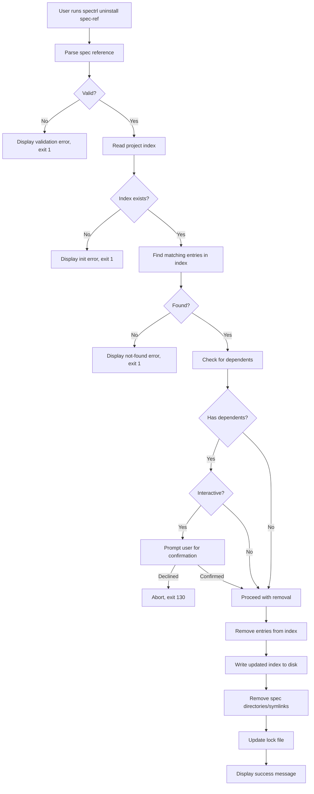

# Design Document: spectrl uninstall

## Overview

The `spectrl uninstall` command removes installed specs from a project by updating the project index, cleaning up spec files from `.spectrl/specs/`, and updating the lock file. It reuses existing infrastructure — `parseSpecRef` for argument parsing, `IndexSchema`/`LockFileSchema` for Zod validation, `removeExistingPath` for safe file cleanup, and the standard `CLIError`/`ExitCode` error handling pattern.

The command follows the same architectural patterns as `install`, `list`, and `unpublish`: a single exported async function in `packages/cli/src/commands/uninstall/index.ts`, registered as a subcommand in `cli.ts`.

## Architecture



## Components and Interfaces

### 1. Uninstall Command (`packages/cli/src/commands/uninstall/index.ts`)

The main module exports a single `uninstall` function:

```typescript
export async function uninstall(specRef: string, options: { cwd: string }): Promise<void>;
```

Internally it orchestrates:

- Spec reference parsing via `parseSpecRef` from `../../utils/spec-ref.js`
- Index reading and validation via `IndexSchema.safeParse`
- Dependent spec detection by reading manifests from sources
- File cleanup via `removeExistingPath` from `../install/index.js`
- Lock file update via `LockFileSchema.safeParse`

### 2. CLI Registration (`packages/cli/src/cli.ts`)

A new `uninstallCmd` is registered using `cmd-ts`:

```typescript
const uninstallCmd = command({
  name: 'uninstall',
  description: 'Remove an installed spec from the project',
  args: {
    specRef: positional({
      type: string,
      displayName: 'spec',
      description: 'Spec reference (name@version, username/name@version, name, or username/name)',
    }),
  },
  handler: async (args) => {
    await uninstall(args.specRef, { cwd: process.cwd() });
  },
});
```

### 3. Reused Components

| Component              | Source                      | Usage                                          |
| ---------------------- | --------------------------- | ---------------------------------------------- |
| `parseSpecRef`         | `utils/spec-ref.ts`         | Parse and validate the spec reference argument |
| `IndexSchema`          | `@spectrl/schema`           | Validate project index read from disk          |
| `LockFileSchema`       | `@spectrl/schema`           | Validate lock file read from disk              |
| `ManifestSchema`       | `@spectrl/schema`           | Validate manifests when checking dependencies  |
| `removeExistingPath`   | `commands/install/index.ts` | Remove symlinks or directories safely          |
| `getProjectIndexPath`  | `utils.ts`                  | Get path to `.spectrl/spectrl-index.json`      |
| `fileExists`           | `utils.ts`                  | Check if project is initialized                |
| `CLIError`, `ExitCode` | `errors.ts`                 | Structured error handling                      |
| `formatHighlight`      | `errors.ts`                 | Colored output for spec names                  |

### 4. Dependency Detection

To check if other specs depend on the one being removed, the command reads the lock file (if it exists) and inspects the `deps` array of each lock entry. This avoids re-reading manifests from source locations, which may be remote URLs.

```typescript
function findDependents(lockEntries: LockEntry[], keysToRemove: string[]): string[];
```

This returns a list of spec keys (e.g., `other-spec@1.0.0`) that have any of `keysToRemove` in their `deps` array.

### 5. Index Entry Matching

When a version is specified, the match is exact against the index key. When no version is specified, all index keys matching the spec name are collected:

```typescript
function findMatchingKeys(index: Index, parsed: ParsedSpecRef): string[];
```

For local specs, matches keys like `name@*`. For public specs, matches keys like `username/name@*`.

## Data Models

All data models are already defined in `@spectrl/schema` and reused as-is:

### Project Index (`IndexSchema`)

```typescript
// Key: "name@version" or "username/name@version"
// Value: { source: string, hash: string }
Record<string, { source: string; hash: string }>;
```

### Lock File (`LockFileSchema`)

```typescript
{
  createdAt: string;        // ISO-8601
  entries: LockEntry[];     // Array of lock entries
}
```

### Lock Entry (`LockEntrySchema`)

```typescript
{
  name: string;
  version: string;
  hash: string;             // sha256:...
  source: string;           // URL
  deps: string[];           // ["dep-name@version", ...]
}
```

### Manifest (`ManifestSchema`)

```typescript
{
  name: string;
  version: string;
  description?: string;
  deps: Record<string, string>;  // { "dep-name": "version" }
  files: string[];
  hash?: string;
  agent?: { purpose: string; tags?: string[] };
}
```

No new schemas are needed. The uninstall command reads and writes these existing structures, validating with Zod on every read.

## Correctness Properties

_A property is a characteristic or behavior that should hold true across all valid executions of a system — essentially, a formal statement about what the system should do. Properties serve as the bridge between human-readable specifications and machine-verifiable correctness guarantees._

### Property 1: Version-less reference matches all versions

_For any_ project index containing multiple versions of the same spec (e.g., `my-spec@1.0.0`, `my-spec@2.0.0`), and a version-less spec reference (e.g., `my-spec`), the `findMatchingKeys` function should return all keys in the index that match that spec name.

**Validates: Requirements 1.3**

### Property 2: Removal removes key from index and result is valid

_For any_ valid project index and any spec key present in that index, after removing that key, the resulting index should not contain the removed key, should contain all other original keys unchanged, and should be parseable by `IndexSchema`.

**Validates: Requirements 2.1, 2.4**

### Property 3: Not-found spec produces error

_For any_ valid project index and any spec reference whose key is not present in the index, calling uninstall should produce a CLIError with a non-zero exit code.

**Validates: Requirements 2.2**

### Property 4: Spec directory no longer exists after removal

_For any_ spec key that is uninstalled, the corresponding path at `.spectrl/specs/{key}` should not exist on the filesystem after the uninstall operation completes.

**Validates: Requirements 3.1, 3.3**

### Property 5: Symlink removal preserves registry target

_For any_ spec installed via symlink, after uninstalling that spec, the symlink should be removed but the target directory in the registry should still exist and be intact.

**Validates: Requirements 3.2**

### Property 6: Lock file entry removed, remaining entries preserved

_For any_ valid lock file and any spec being removed, after the uninstall operation the lock file should not contain the removed spec's entry, should contain all other entries unchanged, and should be parseable by `LockFileSchema`.

**Validates: Requirements 4.1, 4.3**

### Property 7: Dependents correctly identified

_For any_ lock file where spec A's `deps` array contains spec B's key, calling `findDependents` with spec B's key should return a list that includes spec A's key.

**Validates: Requirements 5.1**

## Error Handling

| Scenario                       | Error Type | Exit Code              | Message Pattern                                |
| ------------------------------ | ---------- | ---------------------- | ---------------------------------------------- |
| Empty/malformed spec reference | `CLIError` | `VALIDATION_ERROR` (1) | "Invalid spec reference format: ..."           |
| Project not initialized        | `CLIError` | `VALIDATION_ERROR` (1) | "Project not initialized. Run spectrl init..." |
| Spec not found in index        | `CLIError` | `DEPENDENCY_ERROR` (3) | "Spec {name} not found in project index"       |
| Corrupted index JSON           | `CLIError` | `VALIDATION_ERROR` (1) | "Project index is corrupted..."                |
| I/O error during file removal  | `CLIError` | `IO_ERROR` (2)         | "Failed to remove spec files: ..."             |
| I/O error writing index        | `CLIError` | `IO_ERROR` (2)         | "Failed to update project index: ..."          |
| User cancels confirmation      | `CLIError` | `USER_CANCELLED` (130) | "Uninstall cancelled by user"                  |

All external data (index file, lock file) is validated with Zod `safeParse` before use. No type casting (`as Type`) is used for data read from disk.

## Testing Strategy

### Property-Based Tests (Vitest + fast-check)

The project uses Vitest for testing. Property-based tests will use `fast-check` (the standard PBT library for TypeScript/JavaScript).

Each correctness property maps to a single property-based test with a minimum of 100 iterations. Tests are tagged with the format: `Feature: spectrl-uninstall, Property N: {title}`.

Property tests focus on the pure logic functions:

- `findMatchingKeys` — Properties 1, 2, 3
- `findDependents` — Property 7
- Index/lock file manipulation — Properties 2, 6

Integration-level properties (4, 5) that involve filesystem operations are tested with a temporary directory setup.

### Unit Tests (Vitest)

Unit tests cover specific examples and edge cases:

- Malformed spec reference errors (Req 1.2)
- Uninitialized project error (Req 2.3)
- Missing spec directory on disk — idempotent cleanup (Req 3.4)
- Missing lock file — skip without error (Req 4.2)
- Interactive confirmation prompt behavior (Req 5.2, 5.3, 5.4)
- I/O error handling (Req 6.3)

### Test Configuration

```typescript
// Property test example structure
import { describe, it, expect } from 'vitest';
import fc from 'fast-check';

describe('findMatchingKeys', () => {
  it('should match all versions for version-less reference', () => {
    // Feature: spectrl-uninstall, Property 1: Version-less reference matches all versions
    fc.assert(
      fc.property(
        // generators for index and spec name
        fc.nat({ max: 5 }),
        (numVersions) => {
          // ... property assertion
        },
      ),
      { numRuns: 100 },
    );
  });
});
```

### Dual Testing Approach

- Property tests verify universal correctness across randomized inputs (Properties 1–7)
- Unit tests verify specific examples, edge cases, and error conditions
- Both are complementary: property tests catch general bugs, unit tests pin down specific behaviors
